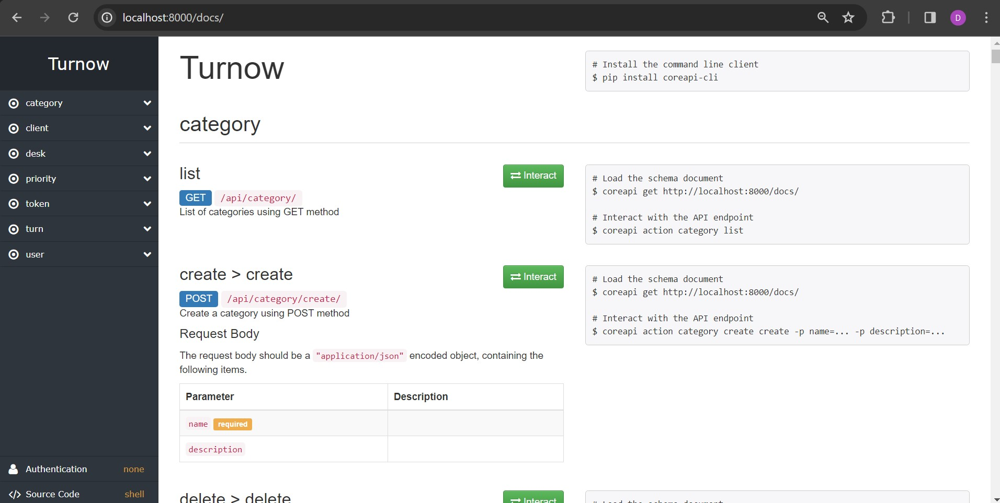
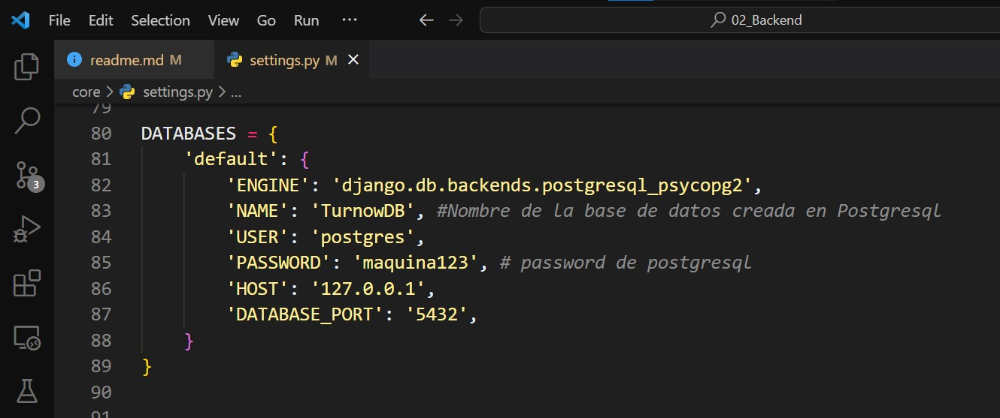
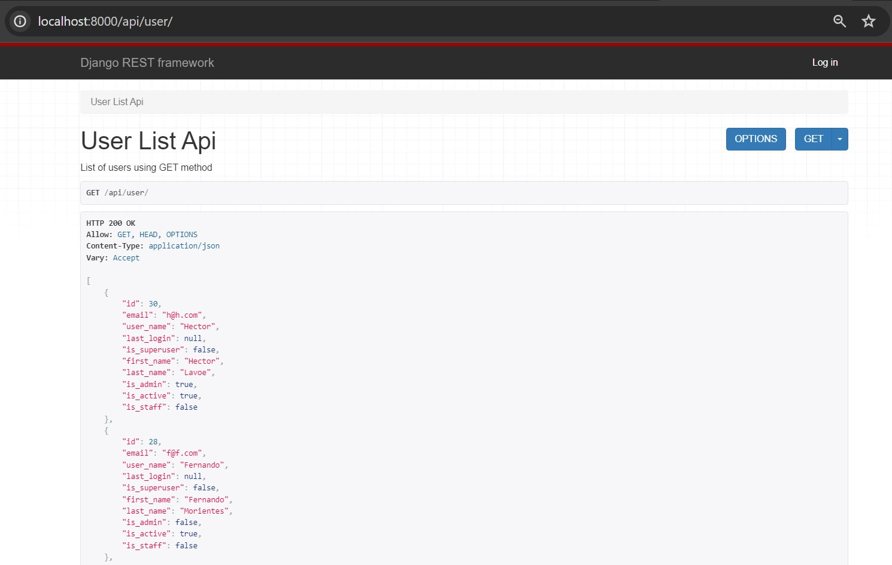
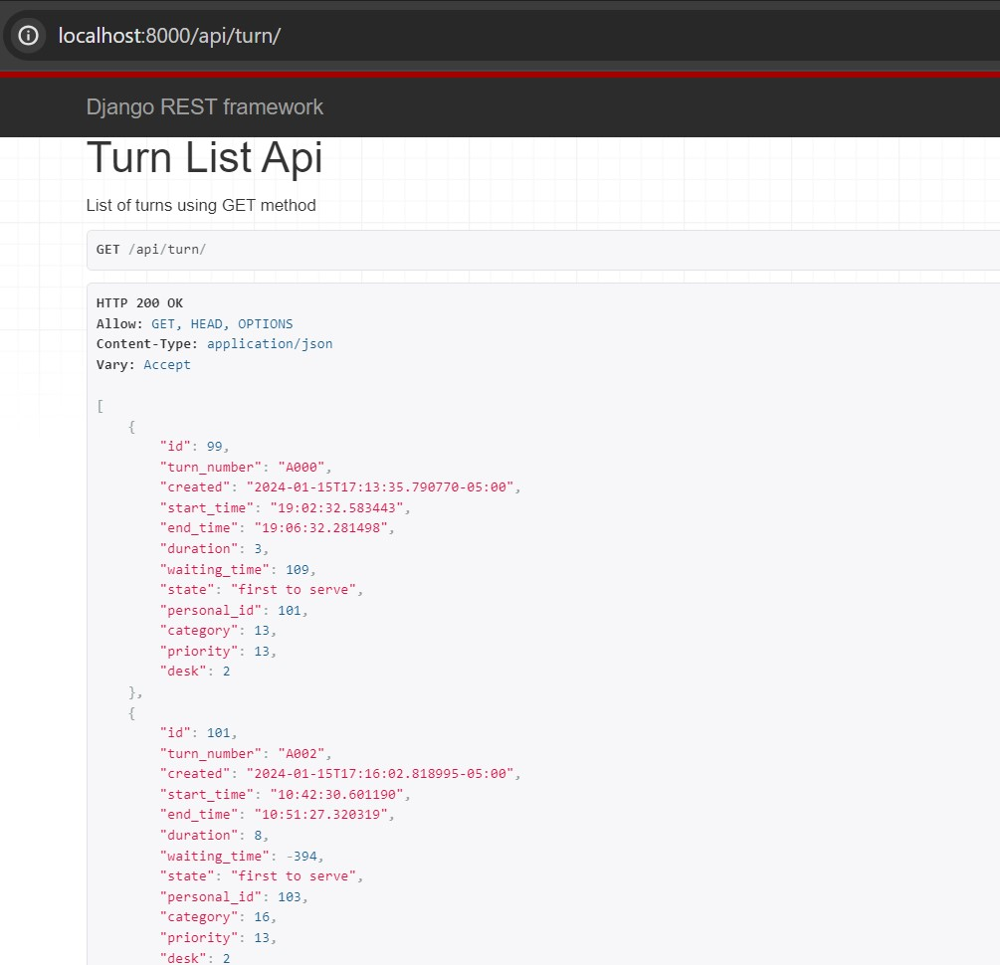

# Turnow Project - Backend (Django rest framework - PostgreSQL)


 


Esta es la sección de Backend del proyecto **"Turnow"**. Esta es una aplicación web que gestiona turnos en diferentes tipos de establecimientos donde haya turnos de espera. En el repositorio *Project_2_Turnow_Frontend* podrás encontrar la información de funcionamiento de la interfaz gráfica.

- En la **carpeta "docs"** de este repositorio se encuentra la documentación del proyecto que incluye diseño, arquitectura, casos de uso, diagrama entidad-relación y tablas.

---

### Resumen de avance del proyecto

El proyecto se encuentra en un 80% de avance.

1. **Funcionalidad:** 90%
   - La gran mayoría de características y funcionalidades principales se han implementado y probado. Pendiente mejorar seguridad del acceso a la base de datos Postgresql.

2. **Pruebas:** Pendiente
   - Los conjuntos de pruebas unitarias y los casos aún están por desarrollarse y ejecutarse. Garantizar pruebas sólidas es una prioridad para las próximas etapas.

3. **Despliegue:** Pendiente
   - Las tareas de implementación, incluida la configuración de servidores o plataformas de alojamiento, están pendientes. Esto es crucial para que el proyecto sea accesible para los usuarios. Se planea realizar en los servicios EC2 de AWS.


A continuación la explicación de puesta en marcha del proyecto y endpoints:

---


## Descripción y puesta en marcha

- Se crea API REST para servir la información de los distintos endpoints que permiten interactuar con la base de datos, estos permiten la gestion de Clientes, usuarios (trabajadores del establecimiento), prioridades, categorias, turnos y toda la lógica de negocio.

- Se utiliza la librería SimpleJWT para gestionar la autenticación de usuarios usando JWT (JSON Web Token).

- Se utiliza la librería Django Channels y el servidor Daphne para gestionar los WebSockets y poder actualizar la página de notificación de turnos, la cual debe recidir el otro navegador distinto de donde se hace el llamado de turnos.

- Se utilizan peticiones HTTP y las respuestas son recibidas en formato JSON.


__Versiones usadas en desarrollo__:

- Sistema operativo local: Windows 10
- Entorno de desarrollo: Visual Studio Code
- Versión de Python: 3.11.1
- Versión de djangorestframework: 3.14.0
- Versión base de datos PostgreSQL: 14
- Versión de Git: 2.39.1.windows.1


__Documentación de API__:

- Se utilizó Swagger para generar la documentación de la API Rest, esta permite interactuar con los endpoints y tener solicitudes y respuestas.

- Modo dev: http://localhost:8000/docs/



---

### Guía de descarga a local:


__1.__ Abre la terminal o línea de comandos en el computador donde deseas descargar el proyecto.

__2.__ Navega al directorio donde deseas almacenar el repositorio.

__3.__ Ejecuta el siguiente comando de Git para clonar el repositorio a la carpeta actual:

```sh
git clone https://github.com/dago-tech/Project_1_Turnow_Backend.git
```

__4.__ Muévete a la rama main:
```sh
git checkout main
```

__5.__ Crea y activa un entorno virtual en la carpeta del proyecto:
```sh
py -m venv venv
```

En powershell:
```sh
venv\Scripts\activate
```
En bash:
```sh
source venv/Scripts/activate
```

__6.__ Instala todas las dependencias:
```sh
pip install -r requirements.txt
```

__7.__ Debes tener PostgreSQL instalado y crear la base de datos con usuario y contraseña. Se deben ajustar los parámetros de la base de datos en el archivo settings.py



- Luego se deben hacer las migraciones a la base de datos, aquí se crean las tablas en ella:
```sh
py manage.py makemigrations
py manage.py migrate
```

__8.__ Correr el servidor de desarrollo:

py manage.py runserver


__9.__ Ya se pueden hacer solicitudes HTTP a este servidor, por ejemplo, usando:

Método GET -->
http://localhost:8000/api/users/


- Visualización de solicitud brindada por la librería de Django Rest Framework:



---

## Endpoints:

__1.__ Se recomienda crear un ***superusuario*** que cuente con email y contraseña para gestionar la aplicación y acceder a los endpoints:

```sh
py manage.py createsuperuser
```


__2.__ En primer lugar, el administrador debe realizar la configuración inicial y establecer usuarios, categorías, prioridades y service desks:

- Crear un usuario administrador:

```json
POST --> http://localhost:8000/api/user/create/

{
    "email": "a@a.com",
    "user_name": "Daniel",
    "password": "",
    "last_login": null,
    "first_name": "Daniel",
    "last_name": "Gutierrez",
    "is_admin": true,
    "is_active": true,
    "is_staff": true
}
```

- Este usuario administrador podrá crear otros usuarios teniendo en cuenta que *"is_admin" = true* significa que el usuario tiene un rol de administrador y *"is_admin" = false* significa que el usuario tiene un rol de Service desk (ver documento "02_Use cases").

- Crear un __usuario__:

```json
POST --> http://localhost:8000/api/user/create/
{   
    "email": "",
    "user_name": "",
    "password": "",
    "last_login": null,
    "first_name": "",
    "last_name": "",
    "is_admin": false,
    "is_active": true,
    "is_staff": true
}
```
- Listar  __usuario__:

```json
GET --> http://localhost:8000/api/user/
```

- Actualizar __usuario__:

```json
PUT-PATCH --> http://localhost:8000/api/user/update/id/
```

- Eliminar a __usuario__:

```json
DELETE --> http://localhost:8000/api/user/delete/id/
```


__3.__ Aquí se muestran los distintos endpoint para crear instancias:

- Crear una __categoría__:

```json
POST - http://localhost:8000/api/category/create/
{   
    "name": "",
    "description": ""
}
```

- Crear una __prioridad__, la prioridad debe ser un número entre 0 y 20 (mayor número - mayor prioridad):

```json
POST --> http://localhost:8000/api/priority/create/
{   
    "name": "",
    "description": "",
    "priority": ""
}
```

- Crear un __service_desk__:

```json
POST --> http://localhost:8000/api/desk/create/
{   
    "name": "",
    "user": "",
    "category": "",
    "state": "",
    "busy": "",
}
```


__4.__ Cuando un cliente llega al establecimiento ingresará su ID, categoría y prioridad al sistema y se creará un cliente y un registro de turnos en la base de datos. El turno se creará con el campo "state" igual a "pending" ("pendiente, en espera"):

- Crear un __cliente__:

```json
POST --> http://localhost:8000/api/client/create/
{   
    "id_type": "",
    "personal_id": ""    
}
```

- Crear un __turno__:

```json
POST --> http://localhost:8000/api/turn/create/
{   
    "personal_id": "",
    "category": "",
    "priority": "",  
}
```

- Obtener un __turno__:

```json
GET --> http://localhost:8000/api/turn/id/

response:
{
    "id": 7,
    "turn_number": "A004",
    "created": "2023-11-14T11:56:34.465636-05:00",
    "start_time": null,
    "end_time": null,
    "duration": null,
    "waiting_time": null,
    "state": "pending",
    "personal_id": 3,
    "category": 1,
    "priority": 1,
    "desk": null
}
```

- Lista de __turnos__:

```json
GET --> http://localhost:8000/api/turn/
```




__5.__ Después de un tiempo de espera, una o más Service desk solicitarán atender a un cliente, el turno del cliente se elegirá según la prioridad, la categoría y el tiempo de creación. Cuando suceda esto Turn.state se actualizará a "first to serve" ("primero en atender"). Tambien Turn.desk se actualizará al módulo de atención (Service desk) del que fue llamado:

```json
PUT --> http://localhost:8000/api/turn/serve/<int:desk_id>/

Turn instance response:
{
    "id": 4,
    "turn_number": "A001",
    "created": "2023-11-13T22:28:04.648374-05:00",
    "start_time": null,
    "end_time": null,
    "duration": null,
    "waiting_time": null,
    "state": "first to serve",
    "personal_id": 1,
    "category": 1,
    "priority": 1,
    "desk": 1
}

```


__6.__ El cliente acudirá al service desk, luego el usuario verificará el número de turno escribiéndolo en el sistema; si es correcto, la instancia de turno se actualizará y el usuario podrá atender al cliente. Turn.state se actualizará a "serving" ("atendiendo"):


```json
PUT --> http://localhost:8000/api/turn/serving/<int:desk_id>/
{   
    "turn_number": "A001",  
}

Turn instance response:
{
    "id": 4,
    "turn_number": "A001",
    "created": "2023-11-13T11:03:04.648374-05:00",
    "start_time": "11:13:14.345258",
    "end_time": null,
    "duration": null,
    "waiting_time": 10,
    "state": "serving",
    "personal_id": 1,
    "category": 1,
    "priority": 1,
    "desk": 1
}
```

- También el estado del service desk es actualizado con:

```json
PATCH --> http://localhost:8000/api/desk/update/<int:desk_id>/

{   
    "busy": true,  
}
Desk instance response:
{
    "id": 1,
    "name": "Modulo 1",
    "state": true,
    "busy": true,
    "user": 1,
    "category": [
        1,
        2
    ]
}
```


__7.__ Cuando el usuario termina de atender al cliente, se deben actualizar los registros de turnos y service desks. Turn.state se actualizará a "served" ("atendido"):

```json
PUT --> http://localhost:8000/api/turn/served/<int:desk_id>/

Turn instance response:
{
    "id": 4,
    "turn_number": "A001",
    "created": "2023-11-13T11:03:04.648374-05:00",
    "start_time": "11:13:14.345258",
    "end_time": "11:19:42.385570",
    "duration": 6,
    "waiting_time": 10,
    "state": "served",
    "personal_id": 1,
    "category": 1,
    "priority": 1,
    "desk": 1
}
```

```json
PATCH --> http://localhost:8000/api/desk/update/<int:desk_id>/
{   
    "busy": false,  
}

Desk instance response:
{
    "id": 1,
    "name": "Modulo 1",
    "state": true,
    "busy": false,
    "user": 1,
    "category": [
        1,
        2
    ]
}
```


__8.__ A este punto, el usuario en el service desk podrá llamar a un nuevo turno y el proceso se repetirá nuevamente.


## Futuras versiones

- La aplicación actualmente guarda los tiempos de creación, espera para ser atendido y tiempo de atención de cada turno, esto lo hace en la tabla de Turnos de la base de datos. Estos datos serán usados para que los usuarios administradores de la aplicación puedan ver estadisticas y gráficos que le permitan sacar conclusiones sobre usuarios o puntos de atención con mayor o menor eficiencia, entre otros.