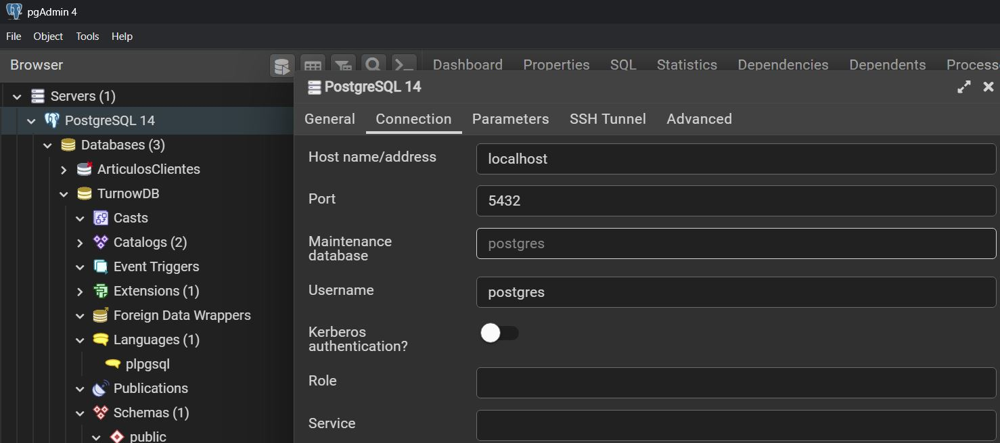

# Proyecto Turnow

API build in Django Rest Framework to cover the backend of this project

1. Create and build the virtual environment in bash console:

```sh
py -m venv venv
source venv/Scripts/activate
```
3. Install Django rest Framework:

```sh
pip install djangorestframework
```
4. Create django project (do not create a new folder):

```sh
django-admin startproject core .
```

5. Create a new app for each database Entity and add it to INSTALLED_APPS in settings.py:
```sh
py manage.py startapp turns
```

6. Try the server:
```sh
py manage.py runserver
```

7. Create a new database in PostgreSQL (PgAdmin), and install the adapter of postgresql for Django:

```sh
pip install psycopg2
```

8. Modify settings.py, update DATABASES:

```py
DATABASES = {
    'default': {
        'ENGINE': 'django.db.backends.postgresql_psycopg2',
        'NAME': 'TurnowDB',
        'USER': 'postgres',
        'PASSWORD': 'maquina123', # General postgresql password
        'HOST': '127.0.0.1',
        'DATABASE_PORT': '5432',
    }
}
```



9. Make migrations:

```sh
py manage.py makemigrations
py manage.py migrate
```

10. Create models and serializers in every app.

11. Add the following statement at settings.py:

```sh
AUTH_USER_MODEL = 'users.CustomUser'
```
12. Make migrations, if there is any problem, delete python migrations files and the database.

13. Create a superuser

```sh
py manage.py createsuperuser
```
username: daniel
email: a@a.com
password: abcd9874

username: Cristiano
email: b@b.com
password: qazxsw1234

- Create visualizations for models in panel admin updating admin.py files.

14. Create the views, urls and add 'rest_framework' to INSTALLED_APPS.
